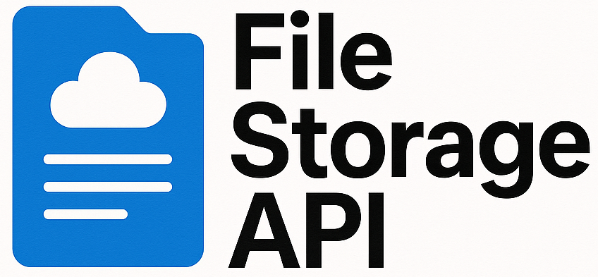

<p align="center">
  <a href="https://github.com/0nF1REy/file-storage-api" target="_blank">
    
  </a>
</p>

<div align="center">

  
  

  
  
  
  
  
  

</div>

## 📖 Descrição

Este repositório abriga o **File Storage API**, uma API REST desenvolvida com o objetivo de facilitar o armazenamento e gerenciamento de arquivos em aplicações web. O sistema permite realizar o **upload**, **listagem** e **download** de arquivos através de requisições HTTP, proporcionando uma solução simples e eficiente para manipulação de documentos.

O projeto foi construído com **Java**, utilizando o **framework Spring Boot**, e está pronto para ser executado com **Maven**. Ele é ideal para ser integrado a outros sistemas ou utilizado como base para aplicações que precisam lidar com arquivos de forma segura e organizada.

## ✨ Funcionalidades

- Upload de arquivos via requisição HTTP multipart/form-data.
- Download de arquivos com headers apropriados para facilitar o uso no navegador.
- Listagem dinâmica dos arquivos armazenados.
- Respostas HTTP claras com URLs para acesso direto aos arquivos.
- Configuração personalizável do diretório de armazenamento no `application.properties`.
- Armazenamento persistente no sistema de arquivos local.

## 🚀 Começando

Os seguintes softwares precisam estar instalados em seu sistema antes de você poder executar o File Storage API:

<div align="center">

## Pré-requisitos

<a href="https://git-scm.com/" target="_blank">
  
</a>
<a href="https://maven.apache.org/" target="_blank">
  
</a>
<a href="https://www.oracle.com/java/" target="_blank">
  
</a>

</div>

*   **Git:** Para controle de versão e clonar o repositório. [https://git-scm.com/](https://git-scm.com/)
*   **Maven:** Para construir e gerenciar dependências do projeto. [https://maven.apache.org/](https://maven.apache.org/)
*   **Java JDK:** Ambiente para executar a aplicação, versão 21 ou superior. [https://www.oracle.com/java/](https://www.oracle.com/java/)

---

## ⚙️ Como Executar o Projeto

Para executar o **File Storage API** localmente, siga estes passos:

1.  **Clone o repositório:**

    ```bash
    git clone https://github.com/0nF1REy/file-storage-api.git
    ```

2.  **Entre no diretório:**

    ```bash
    cd file-storage-api
    ```

3.  **Dê permissão ao Maven Wrapper (Linux/macOS):**

    ```bash
    chmod +x mvnw
    ```

4.  **Execute a aplicação:**

    ```bash
    ./mvnw spring-boot:run
    ```

5. **Acesse a aplicação no navegador:**

    ```
    http://localhost:8080
    ```

---

## 🧪 Endpoints da API

| Ação                  | Método | Endpoint                   | Descrição                             | Exemplo de uso com `curl`                                                  |
|-----------------------|--------|----------------------------|-------------------------------------|---------------------------------------------------------------------------|
| 📤 Upload de Arquivo   | POST   | `/api/files/upload`         | Envia um arquivo para o servidor    | `curl -X POST -F "file=@files_to_upload/siijwrplts391.gif" http://localhost:8080/api/files/upload` |
| 📥 Download de Arquivo | GET    | `/api/files/download/{fileName}` | Faz download de um arquivo armazenado | `curl --output /home/alan/Downloads/siijwrplts391.gif http://localhost:8080/api/files/download/siijwrplts391.gif` |
| 📃 Listagem de Arquivos| GET    | `/api/files/list`            | Retorna lista dos arquivos armazenados | `curl http://localhost:8080/api/files/list`                               |

---

## ⚙️ Configuração

A pasta onde os arquivos serão armazenados pode ser definida no arquivo `src/main/resources/application.properties`:

```properties
# Diretório para upload de arquivos
file.upload-dir=uploads
```
Se o diretório `uploads` não existir na raiz do projeto, ele será criado automaticamente na primeira vez que um arquivo for enviado.

---

<div align="center">

## 👤 Sobre o Desenvolvedor
                       
<table>
  <tr>
    <td align="center">
      <a href="https://github.com/0nF1REy" target="_blank">
        <br>
        <b>Alan Ryan</b>
      </a>
      <p>
        ☕ Peopleware | Tech Enthusiast | Code Slinger ☕<br>
        Apaixonado por código limpo, arquitetura escalável e experiências digitais envolventes.
      </p>
      <p style="font-weight: bold; color: #0077B5;">
        Conecte-se comigo:
      </p>
      <p>
        <a href="https://github.com/0nF1REy" target="_blank">
          
        </a>
        <a href="https://gitlab.com/alanryan619" target="_blank">
          
        </a>
        <a href="https://www.linkedin.com/in/alan-ryan-b115ba228" target="_blank">
          
        </a>
        <a href="mailto:alanryan619@gmail.com" target="_blank">
          
        </a>
      </p>
    </td>
  </tr>
</table>

</div>

---

## 🤝 Contribuindo

Contribuições são bem-vindas! Se você deseja contribuir com o projeto, siga estes passos:

1.  **Faça um fork** do repositório.

2.  **Crie uma branch** para sua funcionalidade ou correção de bug:

    ```bash
    git checkout -b feature/sua-funcionalidade
    ```

3.  **Faça suas alterações**.

4.  **Realize o commit das suas alterações:**

    ```bash
    git commit -m "Adiciona sua funcionalidade ou correção"
    ```

5.  **Envie para o seu repositório forkado:**

    ```bash
    git push origin feature/sua-funcionalidade
    ```

6.  **Abra um pull request** para a branch `main` do projeto original.

### Recursos Úteis

- **<a href="https://www.atlassian.com/br/git/tutorials/making-a-pull-request" target="_blank">📝 Como criar uma solicitação pull</a>**

- **<a href="https://gist.github.com/joshbuchea/6f47e86d2510bce28f8e7f42ae84c716" target="_blank">💾 Padrão de commit</a>**

## 📜 Licença

Este projeto está sob a licença MIT. Consulte o arquivo [LICENSE](LICENSE) para obter mais detalhes.